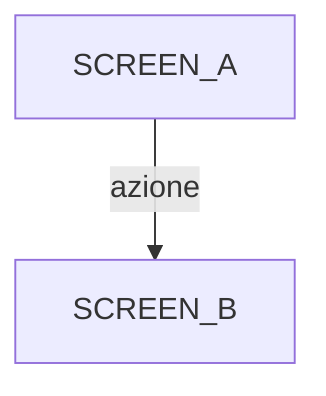
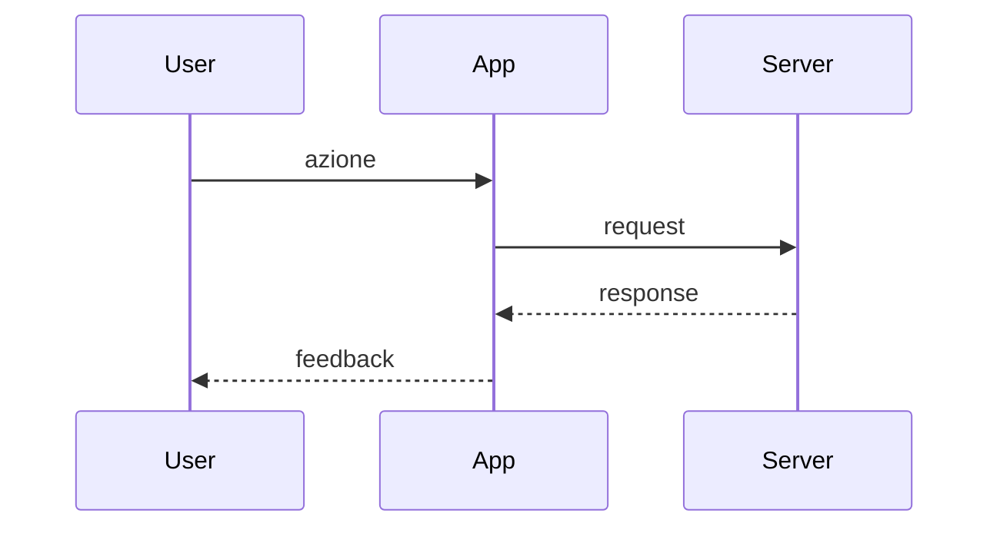
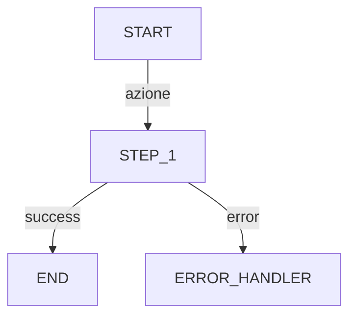

# Functional Map

**Generato:** YYYY-MM-DD HH:MM
**Codebase hash:** [short git hash o file count]
**Aggiornato:** —

---

## Screens

<!--
Per ogni screen/view/page trovata nel codebase.
Formato:

### [Nome Screen]
- **File:** path/to/file.ext #selettore
- **Entry point:** Si/No (default visible al caricamento)
- **Elementi interattivi:**
  - [Tipo] "[Testo/Label]" → handler() → [Effetto]
  - Button "Salva" → save() → API POST /data → CONFERMA
  - Input "Email" → validateEmail() → state.email
  - Link "Dashboard" → navigateTo(DASHBOARD)
-->

### [Screen Name]
- **File:** `path:line`
- **Entry point:** Si/No
- **Elementi interattivi:**
  - [Tipo] "[Label]" → [handler] → [effetto]

---

## State Transitions

<!--
Diagramma Mermaid del grafo di navigazione.
Ogni nodo = screen. Ogni arco = azione utente che causa la transizione.
-->

---

## Personas

<!--
Personas derivate dalla complessita dei flussi.
Formato:

### [Nome Persona]
- **Goal:** [Obiettivo principale]
- **Flusso:** Screen1 → Screen2 → Screen3
- **Touchpoints critici:** [Dove puo bloccarsi/frustrarsi]
- **Tolleranza errori:** Bassa/Media/Alta
-->

### [Persona Name]
- **Goal:** [obiettivo]
- **Flusso:** [sequenza screen]
- **Touchpoints critici:** [punti critici]
- **Tolleranza errori:** Bassa/Media/Alta

---

## Use Cases

<!--
Un use case per ogni flusso utente significativo.
Numerazione:
- UC-001 a UC-099: Flussi core
- UC-100 a UC-199: Flussi secondari
- UC-200+: Edge cases

Formato:

### UC-NNN: [Titolo]
- **Persona:** [nome persona]
- **Precondizioni:** [stato iniziale]
- **Flusso principale:**
  1. [Step 1]
  2. [Step 2]
- **Flussi alternativi:**
  - Na. [alternativa]
- **Ultimo test:** mai — NON TESTATO
-->

### UC-001: [Titolo]
- **Persona:** [persona]
- **Precondizioni:** [precondizioni]
- **Flusso principale:**
  1. [Step]
- **Flussi alternativi:**
  - 1a. [alternativa]
- **Ultimo test:** mai — NON TESTATO

---

## Workflows

<!--
Diagrammi per i flussi piu complessi.
Usare Mermaid sequenceDiagram o graph per mostrare:
- Flusso principale
- Decision points
- Error/fallback branches
- Integrazioni esterne (API, DB)

Formato:

### WF-NNN: [Titolo]

-->

### WF-001: [Titolo]

---

## Coverage Summary

| Metrica | Valore |
|---------|--------|
| Screens trovate | 0 |
| Elementi interattivi | 0 |
| Personas identificate | 0 |
| Use cases totali | 0 |
| Use cases testati | 0 |
| Use cases NON testati | 0 |
| Workflow diagrams | 0 |
